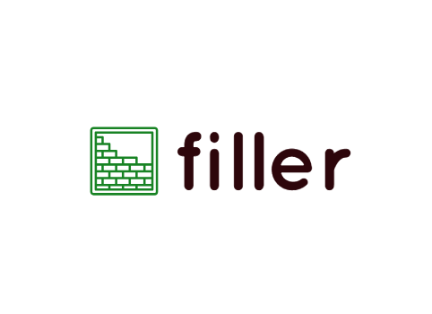
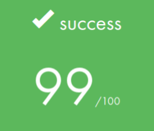
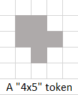
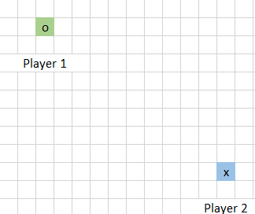
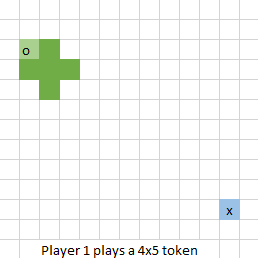
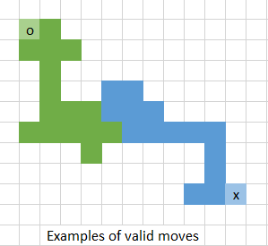

  

# wethinkcode_ Johannesburg

## filler

Algorithms I Project

This project is about creating a game AI that, battles with another user-defined AI for the purpose of conquering the game board. 

Game Rules

1. This a turn-based two player game.
2. The game is played on an empty game board, which is an empty X * N grid.

3. The game master (a Ruby-based gamescript) controls the turns.
4. Each turn, the game master prints:
    - an updated game board and,
    - a new token.

5. Each player has an initial start position:
    - Player 1 is denoted by "o" and "O",
    - Player 2 is denoted by "x" and "X"

6. The objective of the game is to use the token given by the game master to tile a path in order to fill as many spaces on the board. Once a token is placed, a player controls the cells filled.

7. A token can only be placed if the move is valid:
    - a move is valid if one cell has been overlapped 
    - the token placed is not out ouf bounds
    - the token does not overlap the opposing player

## Makefile commands

Library compile using `make`

`make` / `make all`    Compiles all source files into object code and then links to library

`make clean`           Removes `.o` files

`make fclean`          Removes executable file

`make re`              Runs `fclean` then `all` 

`make play`            Shows help

### ./filler_vm commands
`make v00`             runs `./filler_vm` with player 0 (champely.filler) on map00

`make v32`             runs `./filler_vm` with player 3 (abanlin.filler) on map02 etc.

Concepts tested:
- Algorithms (Heuristic, Brute force, Divide & Conquer)
- Game AI 
- Error/Signal handling 
- Unix I/O handling

